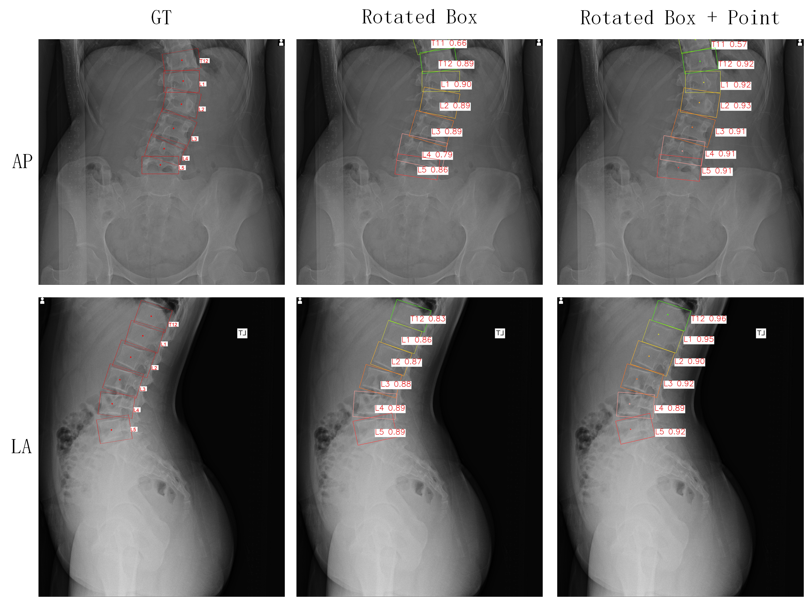

<!--
 * @Description: 
 * @version: 
 * @Author: ThreeStones1029 2320218115@qq.com
 * @Date: 2024-11-27 12:35:08
 * @LastEditors: ShuaiLei
 * @LastEditTime: 2024-11-27 22:22:32
-->
# Yolov5 for Oriented Object Detection 

[Origin Project：Rotation detection using the improved yolov5](https://github.com/hukaixuan19970627/yolov5_obb)

## Note: After improvement, this project carries out multi-task target detection and keypoint output.

## 1、Project Introduction

## 2、Environment Install

## 3、Train

## 4、Eval

## 5、Predict